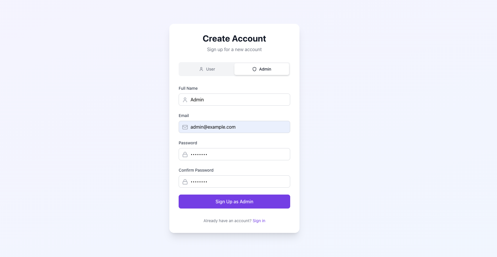
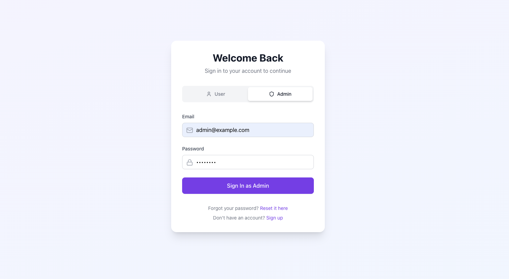
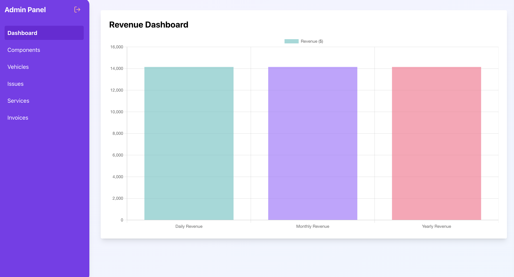
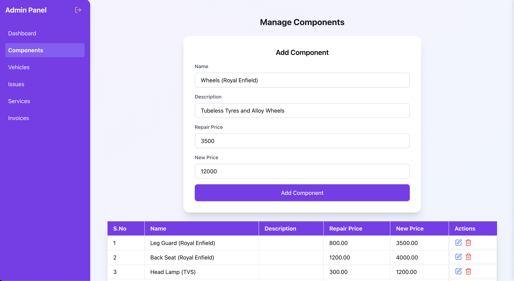
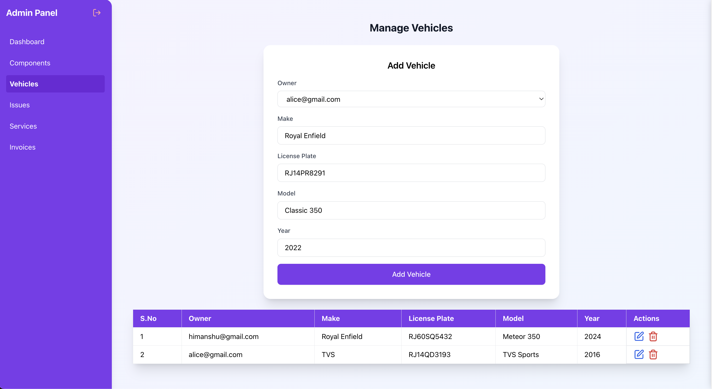
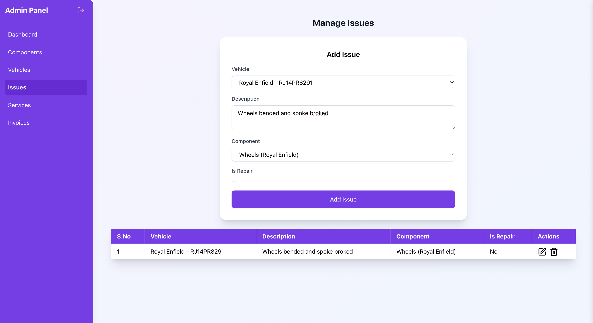
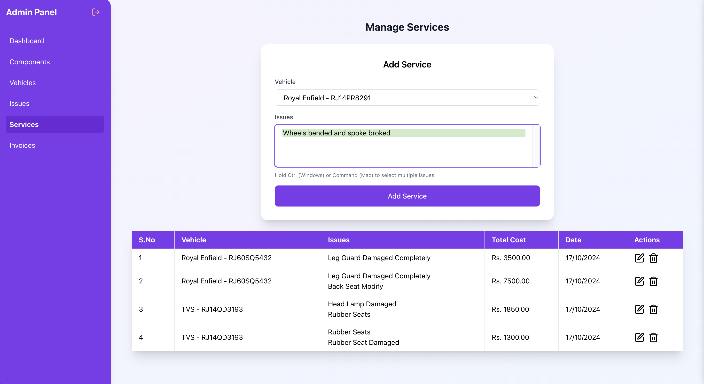
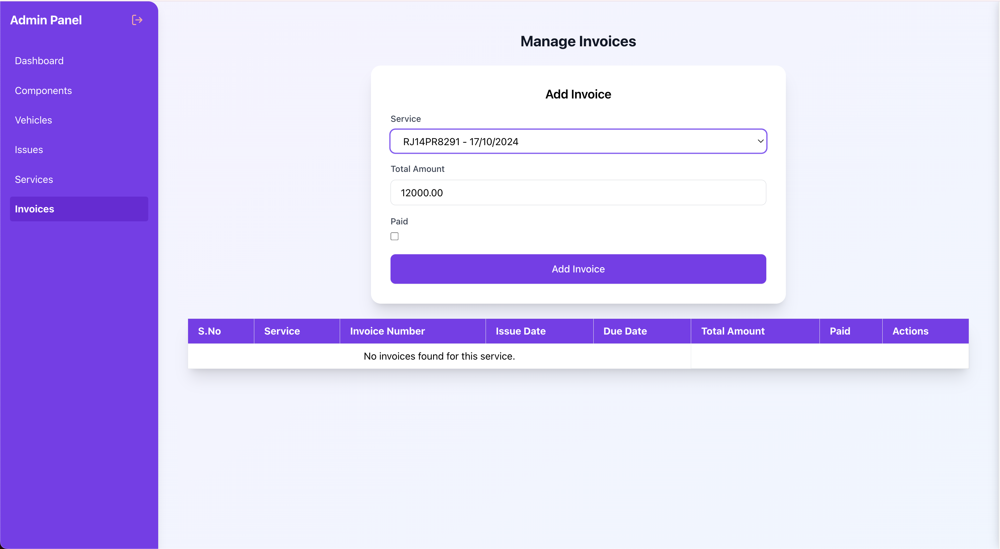
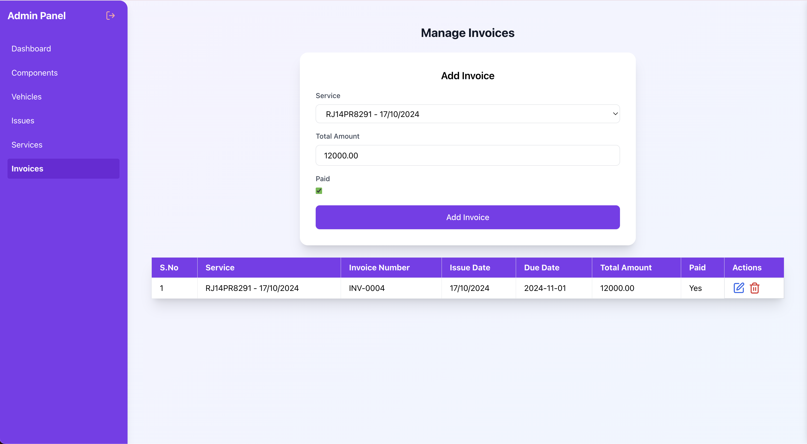

# VeloService: vehicle service system

## Objective
Develop a full-stack web application for managing vehicle services, allowing users to register components, add repair vehicles, track issues, calculate final prices, and view revenue graphs.

## Features
1. **Component Management**: Users can register components with their repair pricing or purchase new components.
2. **Vehicle Management**: Users can add vehicles that require repairs.
3. **Issue Tracking**: Users can log issues for vehicles and choose between new component purchases or repairs.
4. **Price Calculation**: The system calculates the final repair cost, though no real-world transactions are handled.
5. **Revenue Graphs**: Responsive graphs displaying daily, monthly, and yearly revenue using [Recharts](https://recharts.org/en-US/).


## Tech Stack
- Backend: **Django** (Python)
- Frontend: **React.js**
- Database: **PostgreSQL**
- Containerization: **Docker** and **Docker Compose**

## Setup and Run Instructions

### Prerequisites
- Docker and Docker Compose installed on your machine.

### Steps to Run

1. Clone the repository:
    ```bash
    git clone https://github.com/himanshukumar42/VeloService.git
    cd velo_service
    ```

2. Build and run the application using Docker Compose:
    ```bash
    docker-compose up --build
    ```

3. Once the services are up, open your browser and navigate to:
    - **Frontend**: `http://localhost:3000` (React.js)
    - **Backend API**: `http://localhost:8000` (Django)

# Important Information

> ⚠️ **Very Important:** You will need the list of vehicle owners (in Admin Panel) to add Vehicle So to create those vehicle owner create User Account by Sign Up as User

> 
**Installation Steps:**
1. Clone the repository.
2. Run `npm install` to install dependencies.
3. Start the application with `npm start`.

- Note: Please ignore Sign Up or Sign In as User as these functionality will have to be developed letter since the User 
themselves can add Vehicles and Issues. As of now the functionality is Admin can register the Customer vehicles and Issues.

4. The PostgreSQL database will be accessible on `localhost:5434`. 
- Note: I have used 5434 PORT for PostgreSQL since my PORT 5432 was occupied by PG Admin and I wanted to expose 5434 to outside to avoid Port Conflits

### Configuration
The project uses the following environment variables configured in the `docker-compose.yml` file:
- `POSTGRES_DB`: `velo_service_db`
- `POSTGRES_USER`: `velo_user`
- `POSTGRES_PASSWORD`: `velo_password`
- `DB_HOST`: `db`
- `DB_PORT`: `5432`

### Screenshots / Demo Video










## Graphs and Charts
Revenue data is visualized using responsive graphs from [Recharts](https://recharts.org/en-US/), offering insights into daily, monthly, and yearly revenue trends.


## License
This project is licensed under the MIT License.
